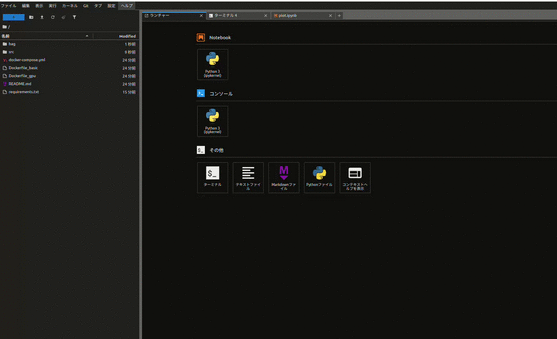

# TL;DR

bagファイルのデータを取り出して，pandasのデータフレーム型で取りだすユーティリティです．
jupyter lab上でデータを扱うことを想定しています．

- jupyter lab 環境でターミナルを開き，`jupyter lab`上でros2 bagができます
  - ブラウザのターミナル上からbagフォルダ内部に記録してください
  - プロジェクトルートはローカルフォルダとマウントしているため，bagファイルの喪失の可能性がありません
  - 念の為，**記録したバグファイルのbackupを定期的に取ること**をおすすめします
- サンプルコードとしてsrcフォルダ内部に`plot.ipynb`があります．
  - bagfileをpandas形式で読み出します
  - bagフォルダ内に記録したbagファイルをそのまま利用可能です
  - csvに書き出す必要がないため，便利です．長尺のbagファイルだと読み込みに時間がかかるかもしれません．




# set up

docker composeでjupyter labの仮想環境を立ち上げます．
adamsなどすでにdocker環境が立ち上がっているPCに導入した後，リモートでアクセスすることを想定します．
sshでアクセスして，サーバを立ち上げてください．

-  CPUのみで実行する場合
```
docker compose build jupyter
docker compose up jupyter
```

- gpuの実行環境が整っている場合
```
docker compose build jupyter-gpu
docker compose up jupyter-gpu
```

gpuのset_upの方法は研究室のnotionページ参照

[nvidia driverのインストール](https://www.notion.so/Jupyter-Lab-c7c0895e101b464c94d23811da65e479)

- ブラウザで以下のポートにアクセスして操作してください．
```
(upyterの場合) localhost:8888
(upyter-gpuの場合) localhost:8899
```

その後，パスワードとして`pass`を一番上のフォームに入力します．
カスタマイズするには，`.env`ファイルを編集してください


- 簡易的にportを指定して立ち上げたい場合(例:7000番)は以下のとおり
```
PORT=7000 docker compose up jupyter
```

- ※サーバを高速に落とすには以下のオプションを選択すると便利です
```
docker compose down --timeout 0
```

# how to use

```converter.py
# bag_converterクラスをインポート
import bag_converter
```
```
# bag_fileには記録したバグファイルを指定して,DBにアクセスします
path = 'bagfilepath'
bag_converter.connectDB(path)
```
```
# 記録したバグファイルのTopic名とメッセージタイプは以下のコマンドで全て確認できます
# bag_converter.getAllMessageNameAndTopicType()
```
```
# .bagファイルから"/topicname"で指定したバグデータを取得
#　dfで取り出されます．
df = bag_converter.getTopicDataWithPandas("/topicname")
```
```
# "/"区切りでメッセージを確認します
df["topic/message/type"].numpy()
```


# refer to
https://github.com/fishros/ros2bag_convert
